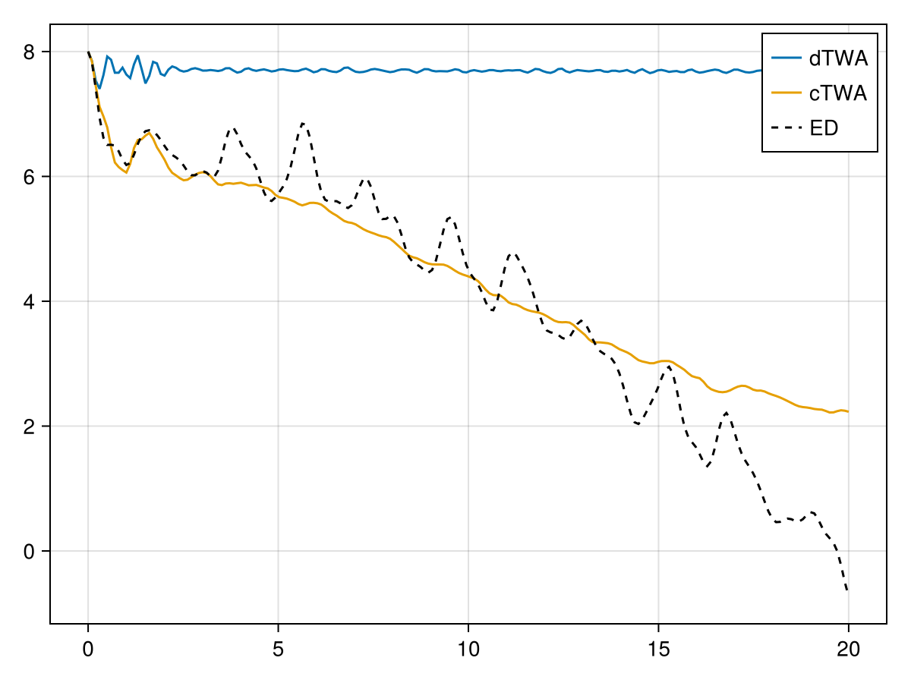

# SpinTruncatedWigner
Use the power of semi-classics to approximate your quantum dynamics.

## Install
This package is not registered and depends on the unregistered `SpinModels.jl`, so use
```julia
Pkg.add(; url="https://github.com/abraemer/SpinModels.jl")
Pkg.add(; url="https://github.com/abraemer/SpinTruncatedWigner.jl")
```

## Workflow
1. Use the types from [SpinModels.jl](https://github.com/abraemer/SpinModels.jl) to define your Hamiltonian, e.g. `H = rand(6, 6) * XXZ(-0.7)`
2. Use one of the types from this package to define the initial state, which are `CoherentSpinState(singlespin, N)`, `NeelState(N, axis=:z)`, `SpinProductState([spin1, spin2,...])` where the single spin directions can be created using `spinHalfup(direction=:z)` and `spinHalfdown(direction=:z)`. E.g.: `psi0 = CoherentSpinState(spinHalfup(:z), 6)`
3. For cluster TWA:
   - Choose a clustering given by a list of indices that belong to the same cluster, e.g. `clustering = [[1,2],[3,4],[5,6]]`. 
   - From this create a `ClusterBasis` object that handles conversion between `(spin index, direction) <-> (operator index)`, e.g. `cb = ClusterBasis(clusterin)`
   - Create your cTWA state by using either `cTWAGaussianState` or `cTWADiscreteState`, e.g.
   `ctwa_state = cTWADiscreteState(cb, psi0)`
4. Choose timepoints to save at, e.g. `times = range(0, 20; length=100)`
5. Create a `TWAProblem` representing your system, e.g. `prob = TWAProblem(cb, H, ctwa_state, times)`
6. Solve it using `OrdinaryDiffEq.jl` (not included here, load separately!), e.g. `sol = solve(prob, Vern8(); trajectories=100, reltol=1e-9, abstol=1e-9)`
7. Extract values of interest. Access like: `sol(t)[trajectory][operator_index]`
    - For dTWA: operators are stored like `[X1, Y1, Z1, X2, Y2, Z2, X3, ...]`
    - For cTWA: Use the `ClusterBasis` object and `lookupClusterOp(clusterbasis, (spin_index, direction))` to gather the correct indices. Here `direction` takes values `1,2,3` to indicate `X,Y,Z`.
    - If you are interested in correlators of spins that are part of the same cluster, then you can pass multiple pairs of `(spin_index, direction)` to `lookupClusterOp()` (throws error, if the spins are not actually part of the same cluster! Use `samecluster(clusterbasis, spin_index1, spin_index2)` to make sure.)

For late times ($\mathcal O(100J)$), I recommend using `Vern7` or `Vern8` and definitively lower the default tolerances.

## Example:
Let's compute the dynamics of the staggered x-magnetization in a nearest neighbour interacting XXZ chain starting from a Neel state in x-direction.
```julia
using SpinModels, SpinTruncatedWigner, OrdinaryDiffEq, Statistics

function staggered_magnetization(state; indices)
    odd = 1:2:length(indices)
    even = 2:2:length(indices)
    return sum(state[indices[odd]]) - sum(state[indices[even]])
end

N = 6
H = NN(Chain(N)) * XXZ(-0.7)
psi0 = NeelState(N, :x)
times = range(0, 20; length=100)

## dTWA
prob_dtwa = TWAProblem(H, psi0, times)
sol_dtwa = solve(prob_dtwa, Vern7(); trajectories = 100, abstol=1e-9, reltol=1e-9)
dtwa_magnetization_indices = 3:3:3N
dtwa_result = [mean(s->staggered_magnetization(s; indices=dtwa_magnetization_indices), sol_dtwa(t)) for t in times]

## cTWA
clustering = collect.(Iterators.partition(1:N,2)) # equivalent to [[1,2],[3,4],[5,6]]
clusterbasis = ClusterBasis(clustering)
cTWAstate = cTWADiscreteState(clusterbasis, psi0)
prob_ctwa = TWAProblem(clusterbasis, H, psi0, times)
sol_ctwa = solve(prob_ctwa, Vern7(); trajectories = 100, abstol=1e-9, reltol=1e-9)
ctwa_magnetization_indices = [lookupClusterOp(clusterbasis, (i, 3)) for i in 1:N]
ctwa_result = [mean(s->staggered_magnetization(s; indices=ctwa_magnetization_indices), sol_ctwa(t)) for t in times]

## exact solution for reference
using LinearAlgebra, SparseArrays
evals, U = eigen(Hermitian(Matrix(H)))
D = Diagonal(evals)
O = sparse(X((-1) .^ (0:N-1)))
Uψ0 = U'*SpinTruncatedWigner.quantum(psi0) # SpinTruncatedWigner.quantum converts the state into a quantum wavefunction
ed_result = zeros(length(times))
for (i,t) in enumerate(times)
    ψt = U*(cis(-D*t)*Uψ0)
    res[i] = real(dot(ψt, O, ψt))
end

# plot with Makie
using CairoMakie
fig, ax, _ = lines(times, dtwa_result; label="dTWA")
lines!(ax, times, ctwa_result; label="cTWA")
lines!(ax, times, ctwa_result; label="ED", color=:black, linestyle=:dash)
axislegend(ax)
display(fig)
```
